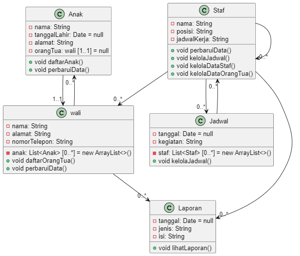
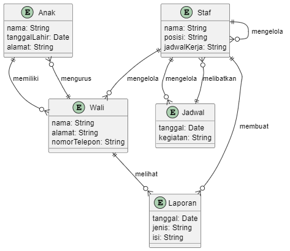
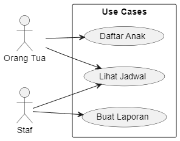

## Penjelasan Diagram Kelas Daycare

 

Diagram ini menggambarkan struktur kelas untuk sistem daycare dengan beberapa entitas utama: `Anak`, `wali`, `Staf`, `Jadwal`, dan `Laporan`.

### Kelas dan Atribut

- **Anak**

  - `nama: String` - Nama anak
  - `tanggalLahir: Date` - Tanggal lahir anak (default: `null`)
  - `alamat: String` - Alamat anak
  - `orangTua: wali [1..1]` - Orang tua/wali dari anak (multiplisitas 1..1)
  - Metode:
    - `daftarAnak()`
    - `perbaruiData()`

- **wali**

  - `nama: String` - Nama wali
  - `alamat: String` - Alamat wali
  - `nomorTelepon: String` - Nomor telepon wali
  - `anak: List<Anak> [0..*]` - Daftar anak-anak (multiplisitas 0..\*)
  - Metode:
    - `daftarOrangTua()`
    - `perbaruiData()`

- **Staf**

  - `nama: String` - Nama staf
  - `posisi: String` - Posisi staf
  - `jadwalKerja: String` - Jadwal kerja staf
  - Metode:
    - `perbaruiData()`
    - `kelolaJadwal()`
    - `kelolaDataStaf()`
    - `kelolaDataOrangTua()`

- **Jadwal**

  - `tanggal: Date` - Tanggal kegiatan (default: `null`)
  - `kegiatan: String` - Nama kegiatan
  - `staf: List<Staf> [0..*]` - Daftar staf yang terlibat (multiplisitas 0..\*)
  - Metode:
    - `kelolaJadwal()`

- **Laporan**
  - `tanggal: Date` - Tanggal laporan (default: `null`)
  - `jenis: String` - Jenis laporan
  - `isi: String` - Isi laporan
  - Metode:
    - `lihatLaporan()`

### Relasi

- **Anak** memiliki **wali** dengan multiplisitas `1..1`.
- **wali** dapat memiliki banyak **Anak** dengan multiplisitas `0..*`.
- **Jadwal** melibatkan banyak **Staf** dengan multiplisitas `0..*`.
- **Staf** mengelola banyak **Jadwal** dengan multiplisitas `0..*`.
- **Staf** mengelola banyak **Staf** lain dengan multiplisitas `0..*`.
- **Staf** mengelola banyak **wali** dengan multiplisitas `0..*`.
- **Staf** membuat banyak **Laporan** dengan multiplisitas `0..*`.
- **wali** dapat melihat banyak **Laporan** dengan multiplisitas `0..*`.

Diagram ini memodelkan interaksi dan relasi antara entitas dalam sistem daycare, menggambarkan bagaimana data dikelola dan dihubungkan dalam sistem.

# Use Case Diagram untuk Daycare System

## Use Cases untuk Orang Tua:

### 1. Daftar Anak

- Parents or guardians can register their children into the daycare system.

### 2. Lihat Jadwal

- Parents or guardians can view the schedule of daycare activities.

## Use Cases untuk Staf:

### 1. Lihat Jadwal

- Staff members can view the schedule of daycare activities.

### 2. Buat Laporan

- Staff members can create reports regarding daycare activities.
